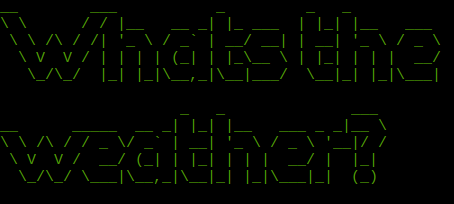
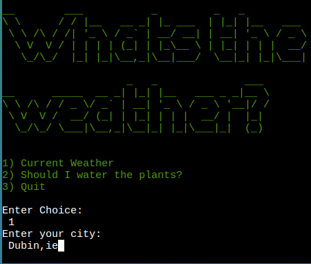
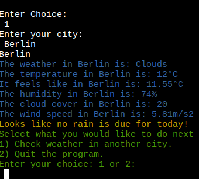
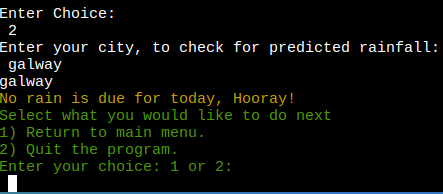

# Table of Contents

- [Table of Contents](#table-of-contents)
- [Site Overview](#site-overview)
  - [Goal](#goal)
  - [Technologies used](#technologies-used)
- [UX](#ux)
  - [Target Audience](#target-audience)
- [Features](#features)
  - [Existing Features](#existing-features)
  - [Future Features](#future-features)
- [Design](#design)
- [Testing](#testing)
  - [Bugs](#bugs)
  - [Known Issues](#known-issues)
- [Deployment](#deployment)
  - [Deployment to Heroku](#deployment-to-heroku)
  - [How to Fork](#how-to-fork)
- [Credits](#credits)
  - [Code](#code)
    - [Version Control](#version-control)
- [Acknowledgments](#acknowledgments)
  

# Site Overview
Deployed Site: [Here](https://whats-the-weather.herokuapp.com/)
Whats the Weather is a simple app that lets users check the current weather of their chosen city and check expected rainfall in a city, with the option of should I water the plants? The app pulls current data from the OpenWeather Api.

## Goal
I wanted to create a app that is both useful and revolves around a topic near and dear to every Irish persons heart....... the weather and the simple possiblity of if rain is likely.

## Technologies used

- [Python](https://www.python.org/) for the main game-play.
- [GitHub](https://github.com/) as a remote repository.
- [Heroku](https://heroku.com) to deploy the website.
- [Replit](https://replit.com) to use as a coding space for testing ideas outside of gitpod
- [OpenWeatherMap](https://openweathermap.org/) The site that I am using their API
- [Ci Python Linter](https://pep8ci.herokuapp.com/) to check python code
- [diagrams.net](https://www.diagrams.net/) for making the flowchart for the app.
- [lunapic](https://www12.lunapic.com/editor/) for my README banner and editing of screen grab images.
- [cssgradient.io](https://cssgradient.io/) to help create the gradient background on heroku

# UX
## Target Audience

- Anyone..... Interested in checking the Weather of a city anywhere in the world.
- Gardeners or outdoorsy folks, looking to save on time watering plants or if they need to bring that all weather jacket.

# Features

## Existing Features
- Welcome Screen:
The welcome screen shows when the player first loads the app. The styling is generated with the pyfiglet module.
On loading the program the user is given three options, 1. To check current weather in any given city, 2. To check rainfall or "Cut to the chase, is it going to rain?" and 3. Quit the program

- Enter City:
On selection of the first option the user is asked to type in a city that they are interested in checking the current weather in.

- Alternate options:
After the details of the city load, the user is asked if they would like to return to the main menu or quit the program

- Cut to the Chase?
using the same api call but purely checking if rain is returned in the city searched, the app with advise the user weather or not its going to rain.

## Future Features
- Historical Data comparison :
 OpenWeatherMap offer a paid option for up to 40 years of previous weather data. In the furture I would love to build functionality that allows a user to check against previous years weather data. This would allow comparing real time data vs historical in a method of seeing the effects of climate change / crisis 
- 5 day forecast:
Building in a option of 5 day forecasting to each city is a feature I would look to add next.
- Add a option of checking national weather warnings:
Expanding on the idea of climate change, checking for weather warnings for different areas.
- In the future I would like to import the tkinter python binding to potentially create a GUI interface for the expanded app.
- In the future I would also like to rebuild this app in a more object oriented programming format. 
- As a late stage addition, I wanted to added ascii art to the notifications on rainfall, the art failed passing through the linter, it is a feature I will add in the future as it is too late before submission to tinker with.

# Design
Below is the flowchart I made to follow along while coding. I initially drew it out on a notepad and then used [diagrams.net](https://www.diagrams.net/) to create it digitally.

# Testing

## Bugs

Bug | Status | Fix |
----|--------|-----|
Using the colorama module, when a invalid option was chosen the continued text would appear in the wrong colour, taking from the previous color option | Resolved | After warnings or invalid options selected Print Style.RESET.ALL to return text to correct colour.
Problem with heroku deployment, Api key not found or loading| Resolved | Spent time with the student support team, they helped by adding lines 11 - 13 for configparser to work
Heroku deploy, in freezing requirments for deployment, requests was not added to the reuirements.txt file| Resolved | Added manually to resolve issue.
5 day forecast option printing, five days worth of weather data on 3 hour increments| Resolved | Removed 5 day forecast option and replaced with check for rain only option (I plan to add this functionality back in, when I have time) .

## CI Python Linter
[Result](readme_docs/CiLINTER.png)

## Known Issues
- As a Dubliner, I know when Dublin, is inputted as the reqeusted city, the app returns the weather for Dublin Ca not Dublin IE
- I am aware the deployed heroku site doesnt load on all phones.

# Deployment 
## Deployment to Heroku
1. Go to [Heroku](https://dashboard.heroku.com/apps)
2. Go to 'New' and select 'Create a new app'
3. Input your app name and create app.
4. Navigate to 'Settings'
5. Install the needed buildpacks. Select Python and install and then node.js and install and then click save. They must be in this order.
6. Navigate to the 'Deploy' section. 
7. Connect to GitHub, search for your repo and confirm. 
8. Choose branch to deploy.
9. Your app should now be available to see. You can choose whether to have your app automatically redeploy with every push or to keep it manual. 

## How to Fork
1. Login/signup to [GitHub](https://github.com/).
2. Locate the relevant repository - in this case [DaveTrev/Whats-the-Weather](https://github.com/DaveTrev/Whats-the-Weather)
3. Click on the 'Fork' button in the upper left.
4. Your forked version of this repo will be generated!

### Version Control
*  Git was used as the version control software. Commands such as git add ., git status, git commit and git push were used to add, save, stage and push the code to the GitHub repository where the source code is stored.

# Credits
## Code
- https://openweathermap.org/ - The source of my API.
- https://www.tutorialandexample.com/how-to-write-a-configuration-file-in-python - As a guide to reading config files and keeping my API keep secret.
- https://www.geeksforgeeks.org/python-ascii-art-using-pyfiglet-module/ - as a guide to using the pyfiglet module.
- https://www.geeksforgeeks.org/print-colors-python-terminal/ - as a guide to colouring text in a python terminal.
-  https://datagy.io/python-requests-timeouts/ - how to set a timeout request for a API call 
- https://stackoverflow.com/questions/66511281/reading-api-keys-with-configparser - StackOverflow thread on Configparser
- https://www.youtube.com/watch?v=baWzHKfrvqw - As a guide to buidling a basic weather app. I have tried to deviate from this as much as possible.
- https://codeigo.com/python/check-if-user-pressed-enter For the code for intro()!
- https://blog.netwrix.com/2022/11/14/how-to-hide-api-keys-github/#:~:text=So%20how%20can%20we%20hide,control%20(e.g.%2C%20gitignore). - Hiding API keys
- https://www.asciiart.eu/nature/rains - Ascii art taken from this site.
- https://www.youtube.com/watch?v=arcFqEuV_XQ - guide to printing ascii art
- https://stackoverflow.com/questions/49103277/python-printing-ascii-art-from-text-file-backslashes-are-being-doubled - printing ascii art

# Acknowledgments

As always, many many thanks to my partner and kids for their ongoing patience while I worked on this project and I would like to thank my mentor [Jubril  Akolade](https://github.com/Jubrillionaire) whos support and patience helped guide me through this project.

> Written with [StackEdit](https://stackedit.io/).